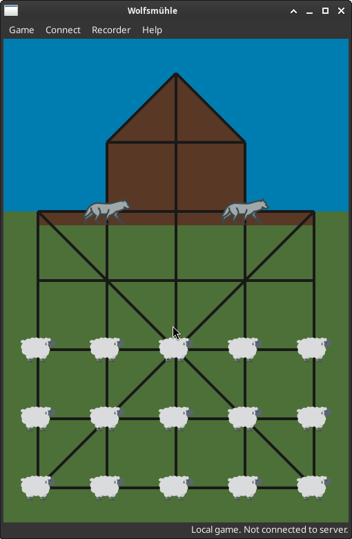

# Wolfsmühle - Eifeler Brettspiel

A board game from the German
[Eifel](https://en.wikipedia.org/wiki/Eifel)
region.



## Game Rules

### Movement

- Players can move their pieces one grid position per turn.
- The wolves and sheep alternate turns.
- Wolves are free to move in any direction.
- Sheep can only move vertically upwards towards the barn, or horizontally.
  They can never move downwards or diagonally.

### Sheep Win Condition

The sheep win if:

- nine sheep occupy the barn at the top of the board.
- or if both wolves are surrounded by sheep and cannot move.

### Wolf Win Condition

The wolves win if:

- fewer than nine sheep are left on the board.

### Capturing Sheep

- A wolf can capture a sheep by jumping over it to an empty space directly behind it.
  The sheep must be on an adjacent grid position to the wolf.
- Wolves can only capture by jumping in a straight line (horizontally, vertically, or diagonally) or across a 135 degree corner.
  Wolves cannot capture across 90 degree corners.
- Multi-capture: A wolf can make multiple captures in a single turn, as long as a valid capture is possible from its new position.
  There is no limit to the number of captures a wolf can make in a single turn.

## Network Game

Wolfsmühle can be played with multiple players over the network.
To play over the network, click on `Connect` and then `Connect to server...` to connect to a game server.

### Starting a Game Server

Run the application with the `--server` option to start a server.

```sh
wolfsmuehle --server
```

See `--help` for more options.
